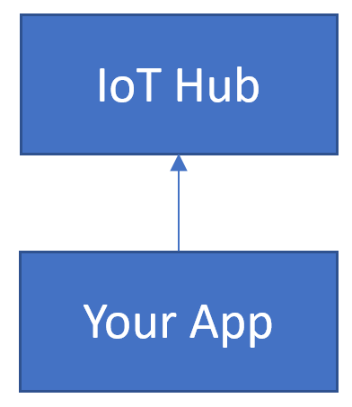

# Event Hubs Data Simulator

## Introduction

This challenge was submitted by Dave Lusty.

Often when testing IoT on Azure it's necessary to create test data and submit it to Event Hub. For this purpose it would be useful to have a simulator to automate this process. The use-cases for this are generally going to be for testing, although sometimes we may need to simulate a customer environment or device.

To complete this challenge you may use any Azure technology you wish, including containers, web apps, functions, or even desktop apps and actual devices.

## Instructions

To complete this challenge you must create some kind of solution which regularly submits data to an Event Hub. Ideally the data format should be easy to define and change to allow testing a wide array of scenarios. Data rates and number of devices/apps might also be customisable as optional extra features.
The more intersting the solution the better here, so please be imaginative!

## Solutions

[Garmin Connect IQ App](Solution1/readme.md)