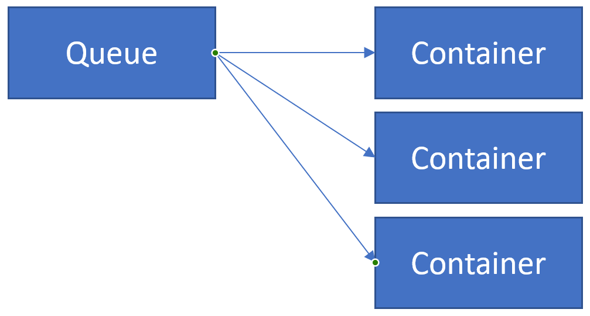

# Queue Processor

## Introduction

This challenge was submitted by Dave Lusty.

It is common in solutions to need to process messages in a queue. This queue may take the form of queue storage, an Event Hub, a service bus, or some other system. One of the benefits of containers is that they spin up and disapear very quickly, and so it's possible to create a container for each incoming message, have that container process one message and then stop itself (this was one of the original use-cases for Docker). In this challenge you need to create such a container solution. 
Real world use-cases could include many kinds of web application where ad hoc traffic needs to be dealt with. It could also be an integration solution between business systems, or a micro-services application.
These kinds of solutions also benefit from "evergreen" code deployment. Since the dockerfile used to create containers on the fly might point to the current branch of code, each message is processed with the very latest code. Using various techniques you may also be able to process a percentage of messages with test code before deploying to production.

## Instructions

Your solution must use container technology and must take messages from some kind of bus to process. Each container instance must process exactly one message before stopping, and should ideally respond to the queue to confirm successful processing.

## Solutions

