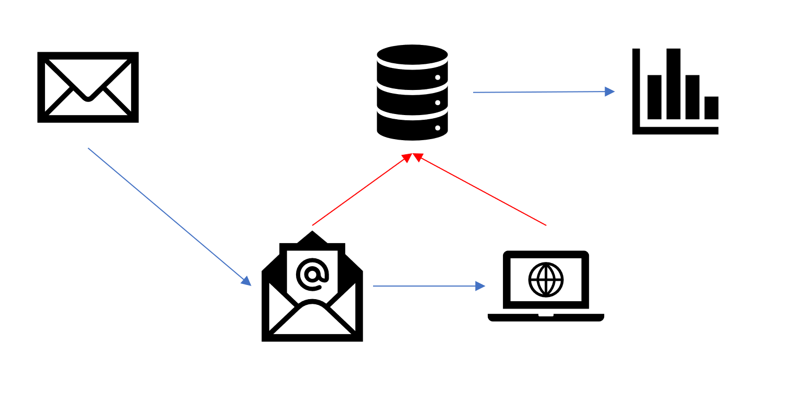

# Click Tracker

## Introduction

This challenge was submitted by Dave Lusty.

Email campaigns are very common these days. It is often useful to track who has viewed the email and when, and then who clicked on the email and visited your link. The purpose here is to send out your email while the customer is reading their email so that you're the top of their inbox every time. You may have noticed some retailers always seem to send an email while you're reading emails. For this to work, it's important to track when someone reads an email, not just when they take action on that mail so we must track the content in addition to tracking when they click on things. You should then be able to analyze on a per user basis when they usually read emails, and send out future mails at those times. There are various ways to achieve this, such as images with custom names (GUID?), custom urls, routing engines such as Microsoft ARR, and many more which you may be able to imagine for yourself.
At the end of this challenge you should be able to automatically produce a dataset showing who viewed the email, who clicked through, and when those things happened so that in the future we can fine tune when the emails are sent to each user.

## Instructions

You need to:
 - Create a system which takes users from a database and sends them a mail. 
 - Records the time that user opened the email.
 - Records the time that user clicked a link to a website.

## Solutions

